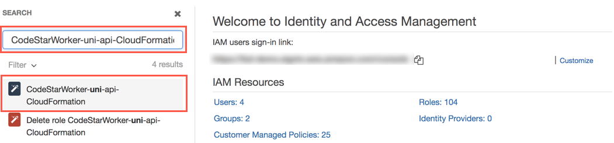
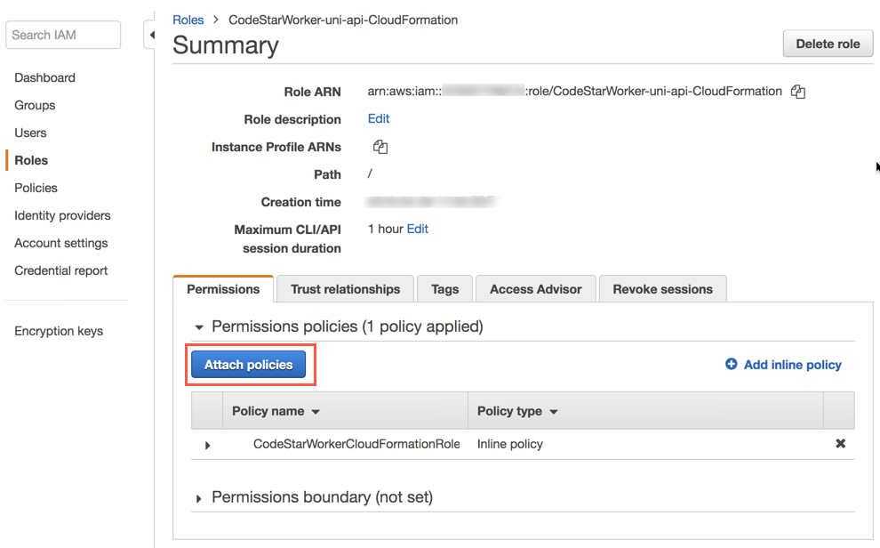
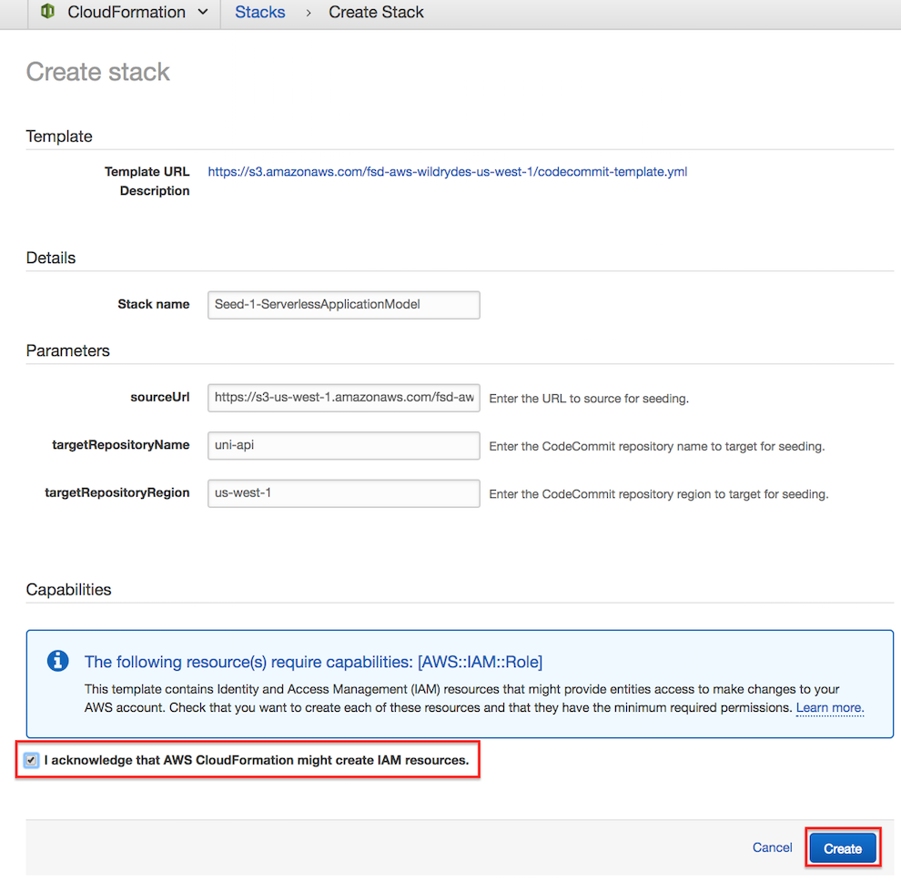
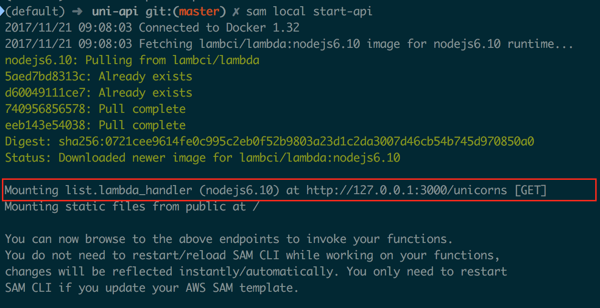
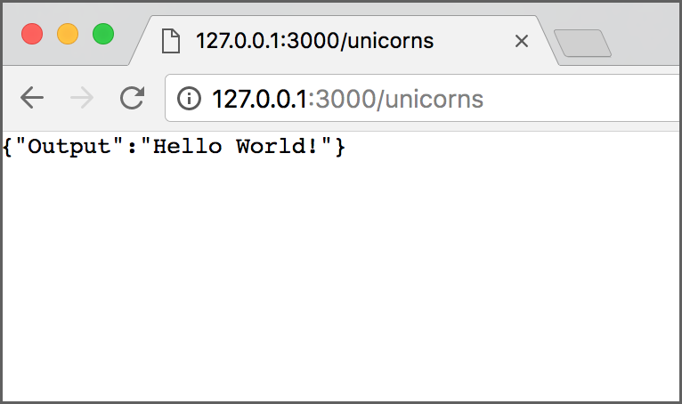

# Module 1: Serverless Application Model

## Environment Setup

### 1. Create CodeStarWorker-uni-api-CloudFormation IAM Role

1. In the AWS Management Console, click Services then select IAM under Security, Identity, & Compliance.

2. Click the **Search IAM** search box.

    

3. Type `CodeStarWorker-uni-api-CloudFormation` in the search box and select **CodeStarWorker-uni-api-CloudFormation** in the left navigation.

    

4. In the IAM Role Summary page, click the **Attach policies** button.

    

5. Type `AWSLambdaFullAccess` in the filter text box, select the checkbox to the left of the **AWSLambdaFullAccess** IAM Role, and click **Attach policy**.

    

6. Upon returning to the IAM Role Summary page, note that the **AWSLambdaFullAccess** policy has been added to the Role.

    


### 2. Seed the `uni-api` CodeCommit Git repository

1. Each module has corresponding source code used to seed the CodeCommit Git repository for the CodeStar project.  To seed the CodeCommit Git repository, click on the **Launch Stack** button for your region below:

    Region| Launch
    ------|-----
    EU (Ireland) | [Launch Module 1 in eu-west-1](https://console.aws.amazon.com/cloudformation/home?region=eu-west-1#/stacks/create/review?stackName=Seed-1-ServerlessApplicationModel&templateURL=https://s3.amazonaws.com/fsd-aws-wildrydes-eu-west-1/codecommit-template.yml&param_sourceUrl=https://s3-eu-west-1.amazonaws.com/fsd-aws-wildrydes-eu-west-1/uni-api-1-v4.zip&param_targetRepositoryName=uni-api&param_targetRepositoryRegion=eu-west-1)


2. The CloudFormation template has been prepopulated with the necessary fields for this module.  No changes are necessary

3. Select the **I acknowledge that AWS CloudFormation might create IAM resources.** checkbox to grant CloudFormation permission to create IAM resources on your behalf

4. Click the **Create** button in the lower right corner of the browser window to create the CloudFormation stack and seed the CodeCommit repository.

    

5. There will be a short delay as the Git repository is seeded with the new source code.  Upon successful completion, the CloudFormation will show Status ``CREATE_COMPLETE``.

    

### 2. Fetch CodeCommit Git Repository

Now that the CodeCommit Git repository has been seeded with new source code, you will need to fetch the changes locally so that you may modify the code.  Typically, this is accomplished using the `git pull` command, however for the workshop we have replaced the repository with a new history and different Git commands will be used.

Using your preferred Git client, run the commands on your local `uni-api` Git repository:

```bash
git fetch --all
git reset --hard origin/master
```

## AWS SAM CLI

[AWS SAM CLI](https://docs.aws.amazon.com/lambda/latest/dg/test-sam-cli.html) is the AWS CLI tool for managing Serverless applications written with [Serverless Application Model (SAM)](https://github.com/awslabs/serverless-application-model).  SAM CLI can be used to test functions locally, start a local API Gateway from a SAM template, validate a SAM template, and generate sample payloads for various event sources.  

### Installation

To complete this module, you will need to install SAM CLI.  If you already have SAM CLI installed, you can skip this section.

#### Prerequisites

Running Serverless projects and functions locally with SAM CLI requires Docker to be installed and running. SAM CLI will use the `DOCKER_HOST` environment variable to contact the docker daemon.

* Windows: [Docker Toolbox](https://download.docker.com/win/stable/DockerToolbox.exe)
* Linux: [Docker Toolbox](https://docs.docker.com/install/linux/docker-ce/ubuntu/) Dont forget the post installation steps
(https://docs.docker.com/install/linux/linux-postinstall/)  

For Windows users: SAM CLI requires that the project directory (or any parent directory) is listed in Docker file sharing options.

Verify that docker is working, and that you can run docker commands from the CLI (e.g. `docker ps`). You do not need to install/fetch/pull any containers - SAM CLI will do it automatically as required.

#### Windows, Linux with pip

The easiest way to install **`sam`** is to use [pip](https://pypi.org/project/pip/).

To use pip, you must have [Python](https://www.python.org/) installed and added to your system's Environment path.

```bash
pip install aws-sam-cli --user
```

Verify the installation worked:

```bash
sam --version
```


##### Setup Port Forwarding Configuration

SAM CLI can start an HTTP server locally on EC2 instance on port 3000.  In order to view content on that HTTP server through the browser on your laptop, you need to configure port forwarding.

##### Port Forwarding on MacOS

On your workstation, open a new terminal and run the following command.  In the command, replace ***~/mykeypair.pem*** with the location and file name of your .pem file and replace ***ec2-###-##-##-###.compute-1.amazonaws.com*** with the public DNS name of your EC2 developer instance:

   ```
   `ssh -i `~/mykeypair.pem -N -L 3000:localhost:3000 ec2-user@ec2-###-##-##-###.compute-1.amazonaws.com
   ```

##### Port Forwarding with Putty on Windows

1. In your putty configuration, select **Connection** , **SSH** , **Tunnels** and add a mapping:

   ```
   Source port: 3000
   
   Destination: 127.0.0.1:3000
   ```

   The configuration should look like this:

   

##### Port Forwarding with Bitvise SSH Client on Windows

1. In **Profile** window, select **C2S** tab, create an entry with this configuration:

   ```
   Listen Interface: 127.0.0.1
   
   List. Port: 3000
   
   Destination Host: localhost
   
   Dest. Port: 3000
   ```

   C2S configuration should look similar to this:

   

## SAM CLI Development

In this section, you will use SAM CLI on your workstation to run the Unicorn API and test changes to it without having to deploy to AWS.

### Run API Gateway locally

1. From the **`uni-api`** directory, run the following command:

   ```bash
   sam local start-api
   ```
   
   If port forwarding from an EC2 developer instance, run the following command:

   ```bash
   sam local start-api --host 0.0.0.0
   ```

   This will spawn a local API Gateway to test HTTP request/response functionality. Features hot-reloading to allow you to quickly develop, and iterate over your functions.  **`sam`** will automatically find any functions within your SAM template that have `Api` event sources defined, and mount them at the defined HTTP paths.

   Once successful, you should see output similar to the screenshot below:

   

2. Open a browser and enter `http://{HOSTNAME}:3000/unicorns` in the address bar.  Confirm that you see the output below:

   

Congratulations!  You have successfully used SAM CLI to start a local development environment.  Keep the window open that is running the `sam local start-api` command until this module is complete.

Next, let's look at how you can use SAM CLI to test changes to your API.

### Test code changes locally

**Goal**: Update `public/assets/index.html` to change one of the prints to the screen.  Remember, the local API Gateway supports hot-reloading of code changes.  There is no need to restart the `sam local start-api` process to see changes.

<details>
<summary><strong>
HOW TO update code and verify results (expand for details)
</strong></summary>

1. Open `app/list.js` in a text editor, update the message to read `Hello HP!`, and save the changes.

2. Refresh the browser and confirm that you see the new string</details>
<p>

You may now kill the SAM CLI running process.

## Completion

You have successfully performed local development and testing of a RESTful serverless API using the Serverless Application Model.  Please close the window running the `sam local start-api` command before preceding to the next module.
