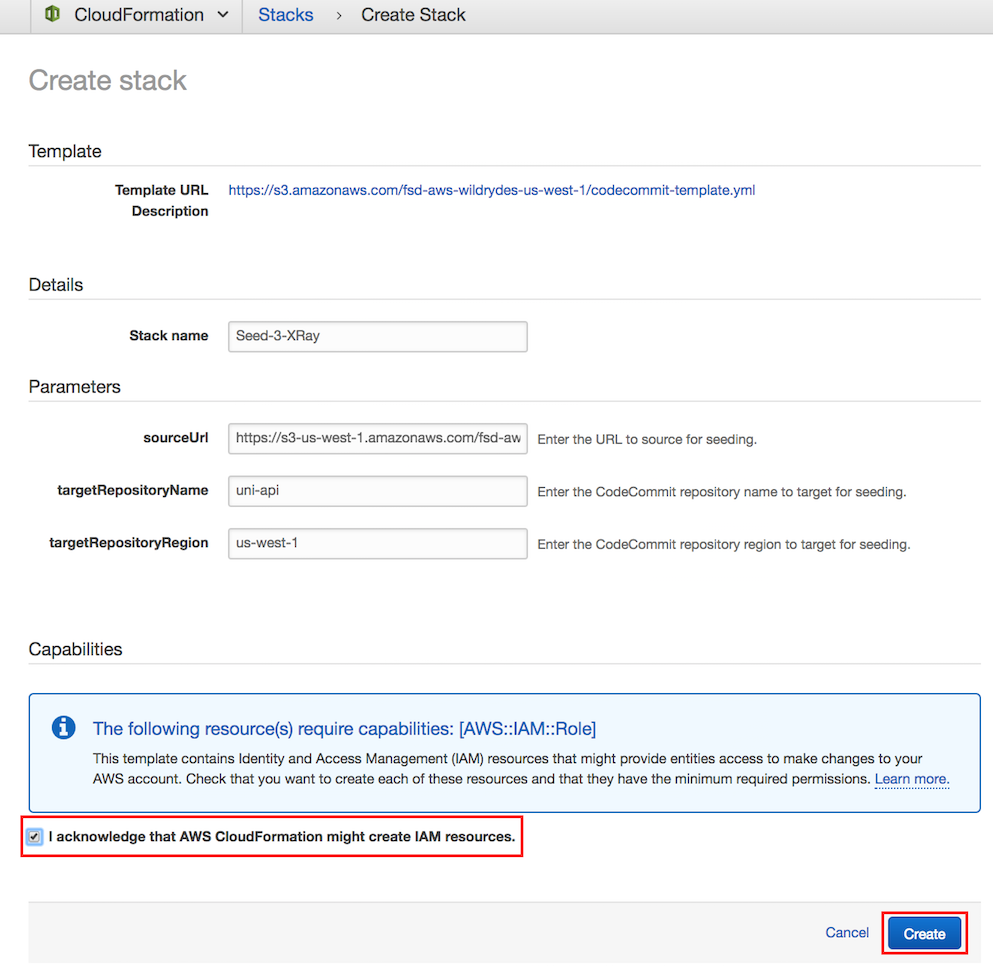
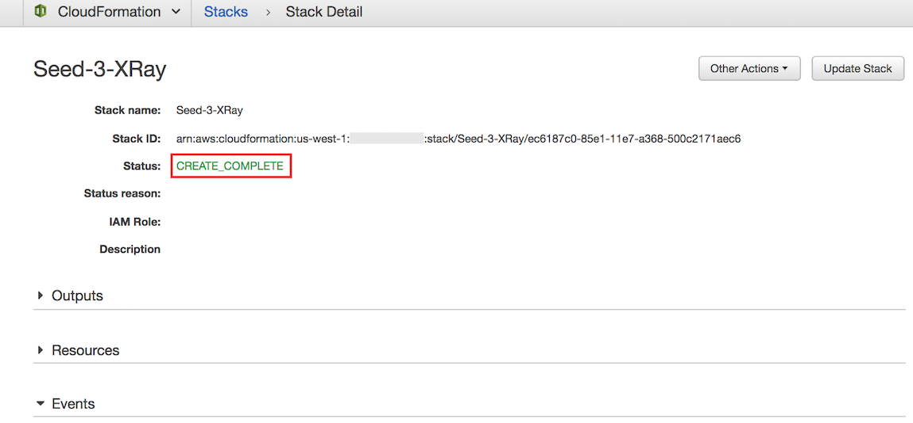
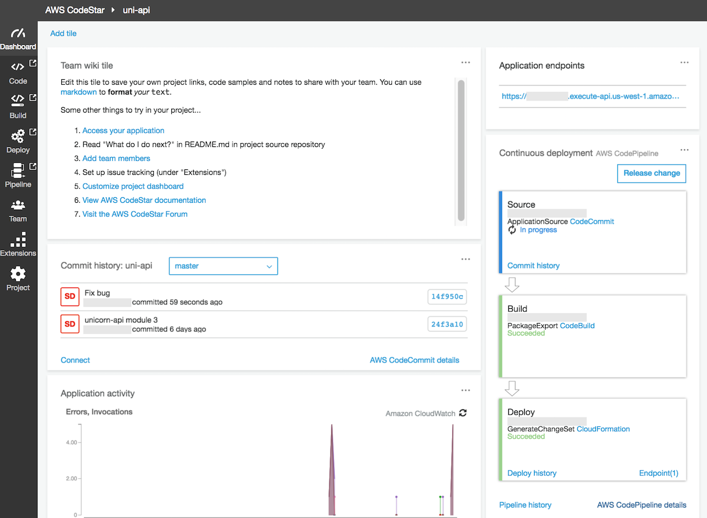
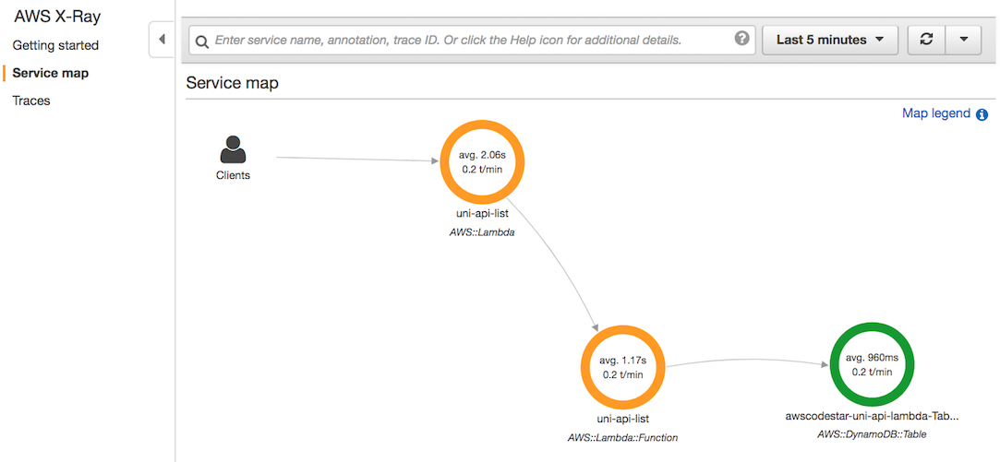
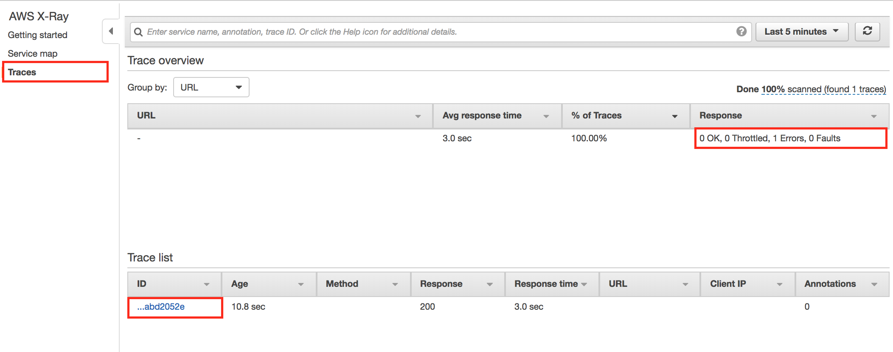
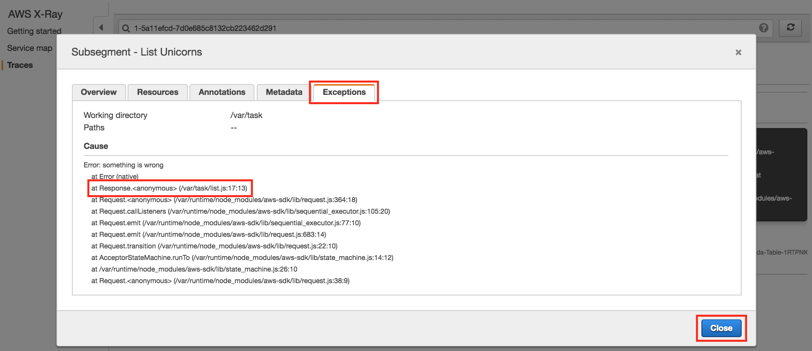
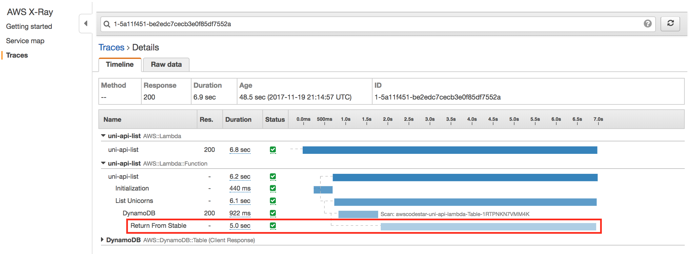

# Module 3: AWS X-Ray Integration


## Environment Setup

**Note:** For the Lambda Function to access the X-Ray Service, the **LambdaExecutionPolicy** must include the **arn:aws:iam::aws:policy/AWSXRayDaemonWriteAccess** Managed Policy.  For simplification, this policy has been added to the **template.yml** file, which will now look like the following:

```
  LambdaExecutionRole:
    Description: Creating service role in IAM for AWS Lambda
    Type: AWS::IAM::Role
    Properties:
      RoleName: !Sub 'CodeStar-${ProjectId}-Execution${Stage}'
      AssumeRolePolicyDocument:
        Statement:
        - Effect: Allow
          Principal:
            Service: [lambda.amazonaws.com]
          Action: sts:AssumeRole
      Path: /
      ManagedPolicyArns:
        - arn:aws:iam::aws:policy/service-role/AWSLambdaBasicExecutionRole
        - arn:aws:iam::aws:policy/AmazonDynamoDBFullAccess
        - arn:aws:iam::aws:policy/AWSXRayDaemonWriteAccess
      PermissionsBoundary: !Sub 'arn:${AWS::Partition}:iam::${AWS::AccountId}:policy/CodeStar_${ProjectId}_PermissionsBoundary'
```


### 1. Seed the `uni-api` CodeCommit Git repository

1. Each module has corresponding source code used to seed the CodeStar CodeCommit Git repository to support the workshop.  To seed the CodeCommit Git repository, click on the **Launch Stack** button for your region below:

    Region| Launch
    ------|-----
    EU (Ireland) | [Launch Module 3 in eu-west-1](https://console.aws.amazon.com/cloudformation/home?region=eu-west-1#/stacks/create/review?stackName=Seed-3-XRay&templateURL=https://s3.amazonaws.com/fsd-aws-wildrydes-eu-west-1/codestar-template.yml&param_sourceUrl=https://s3-eu-west-1.amazonaws.com/fsd-aws-wildrydes-eu-west-1/uni-api-3-v4.zip&param_targetProjectId=uni-api&param_targetProjectRegion=eu-west-1)


2. The CloudFormation template has been prepopulated with the necessary fields for this module.  No changes are necessary

3. Select the **I acknowledge that AWS CloudFormation might create IAM resources.** checkbox to grant CloudFormation permission to create IAM resources on your behalf

4. Click the **Create** button in the lower right corner of the browser window to create the CloudFormation stack and seed the CodeCommit repository.

    

5. There will be a short delay as the Git repository seeded with the new source code.  Upon successful completion, the CloudFormation will show Status ``CREATE_COMPLETE``.

    


### 2. Fetch CodeCommit Git Repository

Now that the CodeCommit Git repository has been seeded with new source code, you will need to fetch the changes locally so that you may modify the code.  Typically, this is accomplished using the `git pull` command, however for the workshop we have replaced the repository with a new history and different Git commands will be used.

Using your preferred Git client, run the commands on your local **uni-api** Git repository:

```bash
git fetch --all
git reset --hard origin/master
```


### 3. Validate CodePipeline Unicorn API Deployment

After the repository has been seeded, it will start a pipeline execution.  Monitor the pipeline until you observe the pipeline completion, indicated by the **Deploy** stage turning green.


</details>


### 4. Exercise List Unicorns API Method

**Goal:** Use the CodeStar Console to find the Application Endpoint, and use your browser to test the "/unicorns" list resource.

<details>
<summary><strong>
HOW TO test the List Unicorns API (expand for details)
</strong></summary>
<p>

1. In the AWS Management Console choose **Services** then select **CodeStar** under Developer Tools.

1. Select the `uni-api` project

    

1. Copy the URL from the **Application endpoints** tile on the right side of the dashboard.

    

1. Paste the URL in a browser window and append `/unicorns` to the path and hit enter.  For example: `https://xxxxxxxxxx.execute-api.us-east-1.amazonaws.com/Prod/unicorns/`
</details>
<p>

Your browser should return an error, like the following.  Refresh your browser multiple times to register visits to the REST API.

   ```json
   {
     "message": "Internal server error"
   }
   ```

Oh no!  A bug has been introduced in this version of Unicorn API.  Let's use X-Ray to identify the error that occurred.


## Problem 1. Error Discovery Using X-Ray

Okay, so your code has a bug.  No problem, let's use AWS X-Ray to investigate!

**Goal:** Use AWS X-Ray to view the Service Map and drill down into the Trace to determine the cause of the error.

<details>
<summary><strong>
HOW TO use AWS X-Ray to locate the code bug (expand for details)</strong></summary>
<p>

1. In the AWS Management Console, click **Services** then select **X-Ray** under Developer Tools.


2. Click **Get started**

    

3. Click **Cancel**

    

4. The X-Ray Console will open to a Service map that should look similar to the screenshot below:



**Important**
> There can be a slight delay for X-Ray to ingest and process the API calls.  If you don't see the above picture, try refreshing the browser window.


### Service Map

The image shows a client, your browser, connecting to the **AWS::Lambda** resource, which represents the warmup of the Lambda function.  The second connection to the **AWS::Lambda::Function** represents the call to `list.lambda_handler`, which is the handler defined in the `template.yml` template.  The third connection to the **AWS::DynamoDB::Table** represents the queries to the DynamoDB table that persists the Unicorn Stable.

The orange circles around **AWS::Lambda** and **AWS::Lambda::Function** indicates there is an error when making the HTTP calls between these services.


### Traces

1. In the left nav, click on **Traces**.

1. In the **Trace Overview**, note that (in this scenario) there is 1 Error in the list of Responses.  In the **Trace List**, below the **Trace Overview**, click on the first Trace in the list to open the **Trace Detail** page.

   

1. On the **Trace Detail** page, note the **Timeline** of HTTP calls, originating with the API Gateway, but extending to other distributed systems traced by X-Ray.  The Lambda function in the **Trace Detail** listed above the DynamoDB Table has an red warning icon to indicate a **Fault**.

   

1. Click the warning icon to view the Trace **Segment** details (below):

   

1.  In the **Segment Detail**, click the **Exceptions** tab to see the error that was raised and the line of code in `list.js` that caused the error (**line 17** in this example).

1.  Click the **Close** button to close the dialog.
</details>
<p>

Congratulations, you've discovered the error using X-Ray!  Let's locate and fix the bug.


## Problem 1: Resolution

**Goal:** Find and correct the offending Error code in `app/list.js`, then commit and push the code changes to the origin git repository.  Afterwards, use Code Star console to verify successful deployment, and use your browser to confirm the error has been resolved.

<details>
<summary><strong>
HOW TO fix the bug and push code changes (expand for details)
</strong></summary>
<p>


### 1. Fix Code Bug

1.  On your workstation, open the `app/list.js` file and navigate to the line identified in the X-Ray trace, which should look like the following code snippet:

    ```
    docClient.scan(params, function(error, data) {
     // Comment or Delete the following line of code to remove simulated error
     err = Error("something is wrong");
    ```

1. Comment or delete this line to fix the code bug

1. Save the `app/list.js` file.


### 2. Commit the change to local Git repository

1. Using your Git client, add the local changes to the Git index, and commit with a message.  For example:

    ```
    git add -u
    git commit -m "Fix bug"
    ```

1. Using your Git client, push the Git repository updates to the origin.  For example:

    ```
    git push origin
    ```


### 3. Validate CodePipeline Unicorn API Deployment

After pushing your changes to the CodeStar project's CodeCommit git repository, you will confirm that the changes are build and deployed successfully using CodePipeline.

1. In the AWS Management Console choose **Services** then select **CodeStar** under Developer Tools.

1. Select the `uni-api` project

    

1. Observe that the continuous deployment pipeline on the right of the browser window now shows the Source stage to be blue, meaning that it is active.

    

1. Each stage's color will turn blue during execution and green on completion.  Following the successful execution of all stages, the pipeline should look like the following screenshot.

    
    
    
    
### 4. Excercise Unicorn API List Resource

1. In the AWS Management Console choose **Services** then select **CodeStar** under Developer Tools.

1. Select the `uni-api` project

    

1. Copy the URL from the **Application endpoints** tile on the right side of the dashboard.

    

1. Paste the URL in a browser window and append `/unicorns` to the path and hit enter.  For example: `https://xxxxxxxxxx.execute-api.us-east-1.amazonaws.com/Prod/unicorns/`

1. Your browser should return an error, like the following.  Feel free to refresh your broser several times to register multiple visits to the REST API.

Your browser should no longer return an error.  Refresh your browser several times to register multiple REST API requests.

   ```json
   [ ]
   ```

> if you have added Unicorns to your stable, your results above should return a list of the inventory.

</details>
<p>

The bug has been fixed and the API now responds without error.  Let's use X-Ray to validate your results.


### Validation Using X-Ray

Lets see what the AWS X-Ray traces looks like now that you have removed the error.

**Goal:** Use AWS X-Ray to view the Service Map and verify that the error has been resolved.

<details>
<summary><strong>
HOW TO verify the error has been resolved in X-Ray (expand for details)
</strong></summary>
<p>

1. In the AWS Management Console, click **Services** then select **X-Ray** under Developer Tools.  The X-Ray Console will open to a **Service Map** that should look similar to the screenshot below.


**Important**
> There can be a slight delay for X-Ray to ingest and process the API calls.  If you don't see the above picture, try refreshing the browser window.
</details>
<p>

Congratulations!  You've used AWS X-Ray to validate your results.

**BUT NOT SO FAST!**  When you refreshed your browser, did it seem to take a long time to respond?  (Refresh again, if you didn't notice)  Now that the bug has been fixed, there seems to be a performance problem.  Let's use X-Ray to investigate!


## Problem 2. Performance Discovery Using X-Ray

Ok, so your code is a bit slow.  No problem.  By looking in AWS X-Ray traces, we can view the duration of trace segments and subsegments. Let's use AWS X-Ray to see whats going on. 

**Goal:** Using the AWS X-Ray Console, drill down into the X-Ray Traces for the application to identify the delay.

<details>
<summary><strong>
HOW TO use AWS X-Ray to discover the performance delay (expand for details)
</strong></summary>
<p>

1. In the AWS Management Console, click **Services** then select **X-Ray** under Developer Tools.

1. In the left navigation, click on **Traces**.

1. In the **Trace list**, notice that **Response time** is 5 seconds or more (6.8 secs in this example).  Click on the first trace.

   

1. On the **Trace Detail** page, note the **Timeline** of HTTP calls, originating with the API Gateway, but extending to other distributed systems traced by X-Ray.  The subsegment in the **Trace Detail** labeled **Return From Stable** has a long timeline indicating a 5 second execution time.  Since the developer used subsegments and labeled them, we can quickly find the part of the code that is causing the delay.

   

</details>
<p>

Next, let's locate and remove the delay!


## Problem 2: Resolution

**Goal:** Find and correct the code causing the delay in `app/list.js`, then commit and push the code changes to the origin git repository. Afterwards, use Code Star console to verify successful deployment, and use your browser to confirm the error has been resolved.

<details>
<summary><strong>
HOW TO fix the code and push the code back up (expand for details)
</strong></summary>
<p>


### 1. Fix Code Bug

1.  On your workstation, open the `app/list.js` file and find the **Return From Stables** subsegment, which should take you a few lines past the following code snippet:

    ```javascript
    // Comment or Delete the following line of code to remove simulated delay
    const isDelayed = true;

    AWSXRay.captureAsyncFunc('Return From Stables', (subsegment) => {
    ```

1. Comment or delete the line `const isDelayed = true;` to prevent the delay code from running

1. Save the `app/list.js` file.


### 2. Commit the change to local Git repository

1. Using your Git client, add the local changes to the Git index, and commit with a message.  For example:

    ```bash
    git add -u
    git commit -m "Remove delay"
    ```

1. Using your Git client, push the Git repository updates to the origin.  For example:

    ```bash
    git push origin
    ```


### 3. Validate CodePipeline Unicorn API Deployment

After pushing your changes to the CodeStar project's CodeCommit git repository, you will confirm that the changes are build and deployed successfully using CodePipeline.

1. In the AWS Management Console choose **Services** then select **CodeStar** under Developer Tools.

1. Select the `uni-api` project

    

1. Observe that the continuous deployment pipeline on the right of the browser window now shows the Source stage to be blue, meaning that it is active.

    

1. Each stage's color will turn blue during execution and green on completion.  Following the successful execution of all stages, the pipeline should look like the following screenshot.

    


### 4. Excercise Unicorn API List Resource

1. In the AWS Management Console choose **Services** then select **CodeStar** under Developer Tools.

1. Select the `uni-api` project

    

1. Copy the URL from the **Application endpoints** tile on the right side of the dashboard.

    

1. Paste the URL in a browser window and append `/unicorns` to the path and hit enter.  For example: `https://xxxxxxxxxx.execute-api.us-east-1.amazonaws.com/Prod/unicorns/`


Your browser should return an answer much quicker.  Feel free to refresh your browser several times to register multiple REST API requests.

```json
[ ]
```

> if you have added Unicorns to your stable, your results above should return a list of the inventory.

</details>
<p>

The bug has been fixed and the API now responds without delay.  Let's use X-Ray to validate your results!


### Validation Using X-Ray

Lets see what the AWS X-Ray traces looks like now that you have removed the error and the delay.

**Goal:** Use AWS X-Ray to view the Traces and verify that the delay has been resolved.

<details>
<summary><strong>
HOW TO verify the delay has been resolved in X-Ray (expand for details)
</strong></summary>
<p>

1. In the AWS Management Console, click **Services** then select **X-Ray** under Developer Tools.

1. In the left navigation, click on **Traces**.

1. In the **Trace list**, notice that **Response time** is much lower.  The first time the function is executed, the duration may be several seconds due to a Lambda cold start penalty, but subsequent executions (via browser) refresh should show sub-second response times.

   

</details>
<p>

Congratulations!  You've used AWS X-Ray to validate your results.

## Completion

You have successfully integrated AWS X-Ray and demonstrated how it can be used to identify errors, latencies, and aid in resolution.  Next, use the [Cleanup Guide](../9_CleanUp) to cleanup the resources that you've created.

<!--
  In the next [Multiple Environments Module](../4_MultipleEnvironments), you will enhance the pipeline by adding a Beta stage to the pipeline, and incorporate testing in the Beta stage before deploying to Prod.
-->